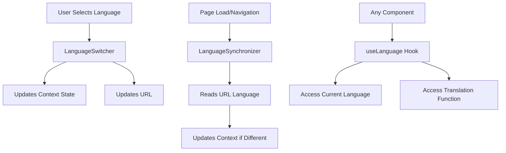
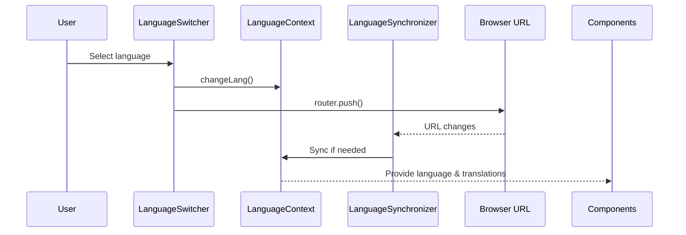

# Next.js Internationalization (i18n) System Documentation

This documentation covers the internationalization system implemented in our Next.js application, which consists of three key components: `LanguageContext`, `LanguageSwitcher`, and `LanguageSynchronizer`.

## Table of Contents

- [System Overview](https://claude.ai/chat/a7c99833-281f-44bf-aeb7-85808acb1701#system-overview)
- [Component Interactions](https://claude.ai/chat/a7c99833-281f-44bf-aeb7-85808acb1701#component-interactions)
- [LanguageContext](https://claude.ai/chat/a7c99833-281f-44bf-aeb7-85808acb1701#languagecontext)
- [LanguageSwitcher](https://claude.ai/chat/a7c99833-281f-44bf-aeb7-85808acb1701#languageswitcher)
- [LanguageSynchronizer](https://claude.ai/chat/a7c99833-281f-44bf-aeb7-85808acb1701#languagesynchronizer)
- [Adding New Languages](https://claude.ai/chat/a7c99833-281f-44bf-aeb7-85808acb1701#adding-new-languages)
- [Troubleshooting](https://claude.ai/chat/a7c99833-281f-44bf-aeb7-85808acb1701#troubleshooting)

## System Overview

The i18n system is designed to provide a seamless multilingual experience through:

1. A context-based state management for language preferences
2. URL-based language routing (e.g., `/en/about`, `/ro/about`)
3. Persistent language settings (via localStorage)
4. Bidirectional synchronization between URL and application state



## Component Interactions

The three components interact in a cycle:

1. **LanguageContext** provides the current language state and translation function to all components
2. **LanguageSwitcher** allows users to change the language, updating both the context and URL
3. **LanguageSynchronizer** keeps the context in sync with the URL when navigating or refreshing



## LanguageContext

The `LanguageContext` is the central state manager for language preferences.

### Key Features:

- Manages the current language state
- Provides the translation function (`t`)
- Persists language preferences in localStorage
- Initializes with default or saved language

### Implementation:

```typescript
// LanguageContext.tsx
"use client";

import {
  createContext,
  useState,
  useContext,
  useEffect,
  ReactNode,
  useCallback,
} from "react";

// Import all translation files
import en from "@/consts/translations/en";
import ro from "@/consts/translations/ro";
import { AvailableLanguage } from "@/types/languageTypes";

// Define types for the translations
type TranslationDictionary = Record<string, any>;

// Define the available languages
const translations: Record<AvailableLanguage, TranslationDictionary> = {
  en,
  ro,
};

// Define the context type
interface LanguageContextType {
  lang: AvailableLanguage;
  changeLang: (newLang: AvailableLanguage) => void;
  t: (key: string) => string;
}

// Create the context with null as initial value
const LanguageContext = createContext<LanguageContextType | null>(null);

interface LanguageProviderProps {
  children: ReactNode;
  initialLang?: AvailableLanguage;
}

export function LanguageProvider({
  children,
  initialLang = "en",
}: LanguageProviderProps) {
  const [lang, setLang] = useState<AvailableLanguage>(initialLang);
  const [isLoaded, setIsLoaded] = useState(false);

  // Load language preference from localStorage (client-side only)
  useEffect(() => {
    if (typeof window !== "undefined") {
      const savedLang = localStorage.getItem("preferredLanguage");
      if (savedLang && ["en", "ro"].includes(savedLang)) {
        setLang(savedLang as AvailableLanguage);
      }
      setIsLoaded(true);
    }
  }, []);

  // Save language preference when it changes
  useEffect(() => {
    if (typeof window !== "undefined" && isLoaded) {
      localStorage.setItem("preferredLanguage", lang);
      document.documentElement.lang = lang; // Optional: update HTML lang attribute
    }
  }, [lang, isLoaded]);

  const changeLang = useCallback((newLang: AvailableLanguage): void => {
    console.log("ChangeLang called with:", newLang);
    if (["en", "ro"].includes(newLang)) {
      setLang(newLang);
      console.log("Language set to:", newLang);
    } else {
      console.warn(`Invalid language code: ${newLang}`);
    }
  }, []);

  // Translation function
  const t = useCallback((key: string): string => {
    const keys = key.split(".");
    let result: any = translations[lang] || translations.en;

    for (const k of keys) {
      if (result && result[k] !== undefined) {
        result = result[k];
      } else {
        console.warn(`Translation key not found: ${key}`);
        return key;
      }
    }

    return result as string;
  }, [lang]);

  const contextValue: LanguageContextType = {
    lang,
    changeLang,
    t,
  };

  return (
    <LanguageContext.Provider value={contextValue}>
      {children}
    </LanguageContext.Provider>
  );
}

export function useLanguage(): LanguageContextType {
  const context = useContext(LanguageContext);
  if (!context) {
    throw new Error("useLanguage must be used within a LanguageProvider");
  }
  return context;
}
```

### Usage:

1. Wrap your application with the `LanguageProvider`:

```tsx
// In your app layout
import { LanguageProvider } from "@/context/LanguageContext";

export default function RootLayout({ children }) {
  return (
    <LanguageProvider>
      {children}
    </LanguageProvider>
  );
}
```

2. Use the `useLanguage` hook in components:

```tsx
import { useLanguage } from "@/context/LanguageContext";

function MyComponent() {
  const { lang, t } = useLanguage();
  
  return (
    <div>
      <h1>{t("welcome.title")}</h1>
      <p>{t("welcome.description")}</p>
      <span>Current language: {lang}</span>
    </div>
  );
}
```

## LanguageSwitcher

The `LanguageSwitcher` component provides a UI for users to change the application language.

### Key Features:

- Displays available languages in a dropdown
- Updates context state when a language is selected
- Updates URL to reflect the new language
- Shows the currently selected language

### Implementation:

```typescript
// LanguageSwitcher.tsx
"use client";

import { useLanguage } from "@/context/LanguageContext";
import { AvailableLanguage } from "@/types/languageTypes";
import { Check, Globe } from "lucide-react";
import {
  DropdownMenu,
  DropdownMenuContent,
  DropdownMenuItem,
  DropdownMenuTrigger,
} from "@/components/ui/dropdown-menu";
import { Button } from "@/components/ui/button";
import { useRouter, usePathname } from "next/navigation";

interface Language {
  code: AvailableLanguage;
  name: string;
}

export default function LanguageSwitcher() {
  const { lang, changeLang } = useLanguage();
  const router = useRouter();
  const pathname = usePathname();
  
  console.log("Current language:", lang);

  const languages: Language[] = [
    { code: "en", name: "English" },
    { code: "ro", name: "Romanian" },
  ];

  const currentLanguage = languages.find((language) => language.code === lang);

  const handleLanguageChange = (code: AvailableLanguage) => {
    console.log("Changing language to:", code);
    changeLang(code);
    
    // Update URL to reflect language change
    // Extract current language from URL and replace it
    const pathParts = pathname.split('/');
    
    // Assuming language is the first part of the path after the initial slash
    if (pathParts.length > 1 && languages.some(l => l.code === pathParts[1])) {
      pathParts[1] = code;
      const newPath = pathParts.join('/');
      router.push(newPath);
    } else {
      // If no language in path, add it
      const newPath = `/${code}${pathname}`;
      router.push(newPath);
    }
  };

  return (
    <DropdownMenu>
      <DropdownMenuTrigger asChild>
        <Button variant="ghost" size="sm" className="flex items-center gap-2">
          <Globe className="h-4 w-4" />
          <span>{currentLanguage?.name || "Language"}</span>
        </Button>
      </DropdownMenuTrigger>
      <DropdownMenuContent align="end">
        {languages.map((language) => (
          <DropdownMenuItem
            key={language.code}
            onClick={() => handleLanguageChange(language.code)}
            className="flex items-center justify-between cursor-pointer"
          >
            <span>{language.name}</span>
            {lang === language.code && <Check className="h-4 w-4 ml-2" />}
          </DropdownMenuItem>
        ))}
      </DropdownMenuContent>
    </DropdownMenu>
  );
}
```

### Usage:

Place the `LanguageSwitcher` component in your navigation bar or header:

```tsx
import LanguageSwitcher from "@/components/languageTranslations/LanguageSwitcher";

function Header() {
  return (
    <header>
      <nav>
        {/* Other navigation items */}
        <LanguageSwitcher />
      </nav>
    </header>
  );
}
```

## LanguageSynchronizer

The `LanguageSynchronizer` component ensures that the language context state stays in sync with the URL.

### Key Features:

- Monitors URL language parameter changes
- Updates the context state when the URL language changes
- Acts as a bridge between routing and context state
- Has no visible UI (returns null)

### Implementation:

```typescript
// LanguageSynchronizer.tsx
"use client";

import { useEffect } from "react";
import { useParams } from "next/navigation";
import { useLanguage } from "@/context/LanguageContext";
import { AvailableLanguage } from "@/types/languageTypes";

const availableLanguages: AvailableLanguage[] = ["en", "ro"];

export default function LanguageSynchronizer() {
  const params = useParams();
  const rawUrlLang = params.lang;
  const urlLang = Array.isArray(rawUrlLang) ? rawUrlLang[0] : rawUrlLang;
  const { lang, changeLang } = useLanguage();

  useEffect(() => {
    console.log("LanguageSynchronizer - URL Language:", urlLang);
    console.log("LanguageSynchronizer - Context Language:", lang);
    
    if (
      urlLang &&
      availableLanguages.includes(urlLang as AvailableLanguage) &&
      urlLang !== lang
    ) {
      console.log("LanguageSynchronizer - Updating language from URL:", urlLang);
      changeLang(urlLang as AvailableLanguage);
    }
  }, [urlLang, lang, changeLang]);

  // This component doesn't render anything visible
  return null;
}
```

### Usage:

Include the `LanguageSynchronizer` in your layout or at the top level of your application:

```tsx
import LanguageSynchronizer from "@/components/languageTranslations/LanguageSynchronizer";

function AppLayout({ children }) {
  return (
    <>
      <LanguageSynchronizer />
      {/* Rest of your layout */}
      {children}
    </>
  );
}
```

## Adding New Languages

To add a new language to the system:

1. **Create translation file**:
    
    - Add a new file in your translations directory (e.g., `fr.ts` for French)
2. **Update type definition**:
    
    - Update the `AvailableLanguage` type:
    
    ```typescript
    // languageTypes.ts
    export type AvailableLanguage = "en" | "ro" | "fr"; // Add new language code
    ```
    
3. **Import and add to translations object**:
    
    ```typescript
    // In LanguageContext.tsx
    import fr from "@/consts/translations/fr";
    
    const translations: Record<AvailableLanguage, TranslationDictionary> = {
      en,
      ro,
      fr, // Add new language
    };
    ```
    
4. **Update validation in changeLang**:
    
    ```typescript
    if (["en", "ro", "fr"].includes(newLang)) { // Add new language code
      setLang(newLang);
    }
    ```
    
5. **Update availableLanguages array in LanguageSynchronizer**:
    
    ```typescript
    const availableLanguages: AvailableLanguage[] = ["en", "ro", "fr"]; // Add new language code
    ```
    
6. **Update languages array in LanguageSwitcher**:
    
    ```typescript
    const languages: Language[] = [
      { code: "en", name: "English" },
      { code: "ro", name: "Romanian" },
      { code: "fr", name: "French" }, // Add new language
    ];
    ```
    
7. **Update static parameters for Next.js routing**:
    
    ```typescript
    // In your app layout
    export async function generateStaticParams() {
      return [
        { lang: "en" }, 
        { lang: "ro" },
        { lang: "fr" }, // Add new language
      ];
    }
    ```
    

## Troubleshooting

### Common Issues:

1. **Language not updating in UI after change**:
    
    - Check if components using `useLanguage()` are memoized properly
    - Verify that the `t` function is being used for all translated text
    - Confirm that the URL is updating correctly
2. **URL not updating with language change**:
    
    - Check the router implementation in `LanguageSwitcher`
    - Verify that `Next.js` routing is configured correctly for i18n
    - Ensure the path parsing logic is working correctly
3. **Language resets after refresh**:
    
    - Check localStorage implementation in `LanguageContext`
    - Verify the `LanguageSynchronizer` is properly detecting URL language
    - Ensure the router configuration is set up for i18n persistence

### Debugging Tips:

1. Add console logs to track language state changes:
    
    ```typescript
    useEffect(() => {
      console.log('Language changed to:', lang);
    }, [lang]);
    ```
    
2. Verify URL structure with console logs:
    
    ```typescript
    console.log('Current pathname:', pathname);
    console.log('Path parts:', pathname.split('/'));
    ```
    
3. Check localStorage state:
    
    ```typescript
    console.log('Stored language:', localStorage.getItem('preferredLanguage'));
    ```
    

---

This documentation covers the core components and interactions of the i18n system. For additional features or custom implementations, refer to the source code and comments within each component.